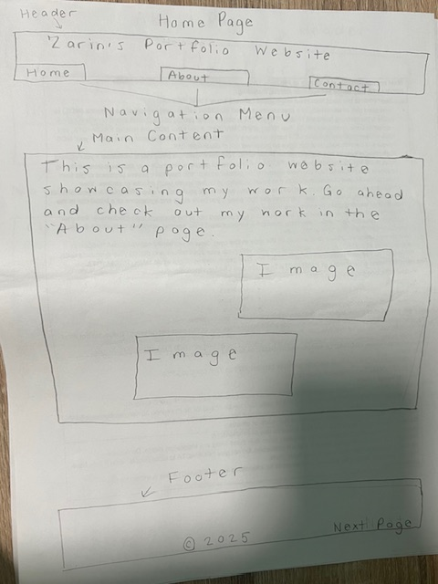

# Zarin Khan's INF6420 Project

A portfolio website showing my work.

## Wireframes

Here are some wireframes showcasing what the sitelayout might look like. I have included wireframes showcasing the homepage, about page, and contact page could possibly look like.

Header - Will include the nagivation menu and a title including my name.

Navigation Menu - Will link to the homepage, about page, and contact page.

Main Content - Will provide an simple explanation about what the website is about.

Footer - Will include a copyright image and ability to go to the next page.

Header - Will include a title for the page.

Navigation Menu - Will include links to possible projects.

Main Content - Will provide an explaination about what the links are in regards to.

Footer - Copyright image and buttons to go to previous page or next page.

Header - Will include a title for the page.

Naviation Menu - Will include links to the contact form, resume, and Lindedln.

Main Content - Will include an explaination explaining the links and their purpose. 

Footer - Copyright image and ability go to previous page. 